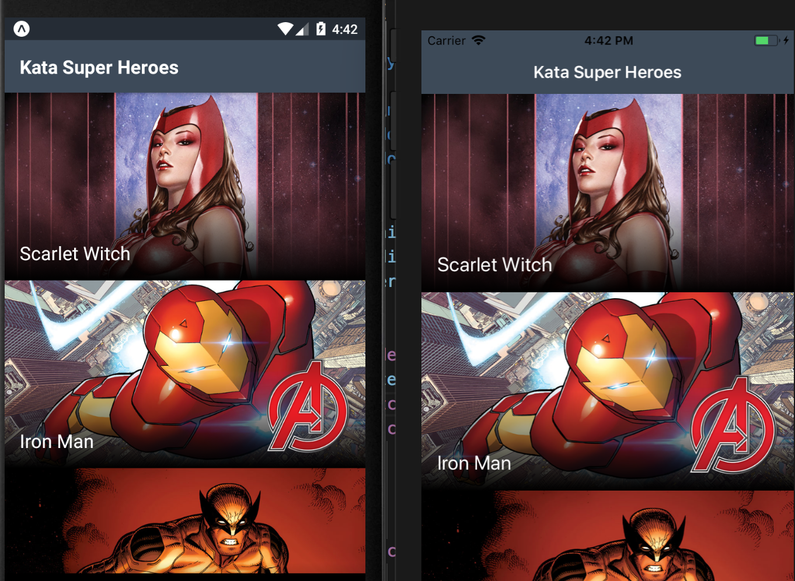
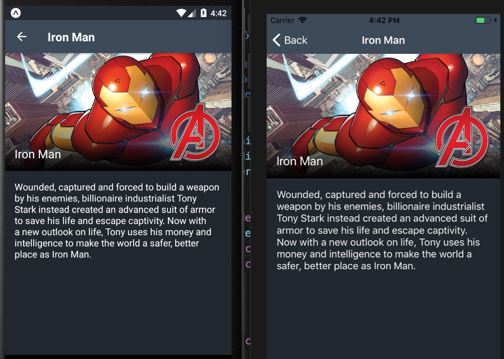

#  KataSuperHeroes in React Native & Typescript 

- We are here to practice testing in React Native.
- We are going to use [React Native](https://facebook.github.io/react-native/) to create our App.
- We are going to use [Typescript](https://www.typescriptlang.org/).
- We are going to use [Jest](https://jestjs.io/) to test our code and replace production code with [Test Doubles](http://www.martinfowler.com/bliki/TestDouble.html).
- We are going to practice pair programming.

---

## Getting started

This repository contains a ReactNative application to show Super Heroes information:

This Application is based on two screens:

* ``MainScreen`` showing a list of super heroes with name, photo and a special badge if is part of the Avengers Team.

* ``SuperHeroDetailScreen`` showing detailed information about a super hero like his or her name, photo and description.

The application architecture, dependencies and configuration is ready to just start writing tests. In this project you'll find  ``Jest`` configured to be able to replace production code with test doubles easily and to be able to interact with the application user interface from the component viewpoint.

## Tasks

Your task as Software Engineer is to **write all the tests** needed to check if the app is working as expected. 

**This repository is ready to build the application, pass the checkstyle and your tests in Travis-CI environments.**

Our recommendation for this exercise is:

  * Before starting
    1. Fork this repository.
    2. Checkout `kata-super-heroes` branch.
    3. Execute the application, explore it manually and make yourself familiar with the code.
    4. Execute `yarn test` and watch the only test it contains pass.

  * To help you get started, these are some test cases already written. Take a look at the ``__tests__`` folders.

## Considerations

* If you get stuck, `master` branch contains already solved tests for the whole app.

* You will find some utilities around the code to help you test the app properly.
  
## Extra Tasks

If you've covered all the application functionality using automated tests try to continue with the following tasks:

* Add a pull to refresh mechanism to the main screen and test it.
* Modify ``SuperHeroDetailScreen`` to handle an error case where the name of the super hero used to start this activity does not exist and show a message if this happens.
* Modify the project to handle connection errors and show a message to the user to indicate something went wrong.

---

## Documentation

There are some links which can be useful to finish these tasks:

* [ReactNativePlayground.](https://github.com/pedrovgs/ReactNativePlayground)
* [SuperHeroes Kata in Kotlin.](https://github.com/Karumi/KataSuperHeroesKotlin)
* [React Native guide.](https://www.reactnative.guide/index.html)
* [Jest documentation.](https://jestjs.io)
* [Typescript cheat sheet.](https://devhints.io/typescript)

Data provided by Marvel. © 2017 MARVEL

# License

Copyright 2018 Karumi

Licensed under the Apache License, Version 2.0 (the "License");
you may not use this file except in compliance with the License.
You may obtain a copy of the License at

  http://www.apache.org/licenses/LICENSE-2.0

Unless required by applicable law or agreed to in writing, software
distributed under the License is distributed on an "AS IS" BASIS,
WITHOUT WARRANTIES OR CONDITIONS OF ANY KIND, either express or implied.
See the License for the specific language governing permissions and
limitations under the License.
